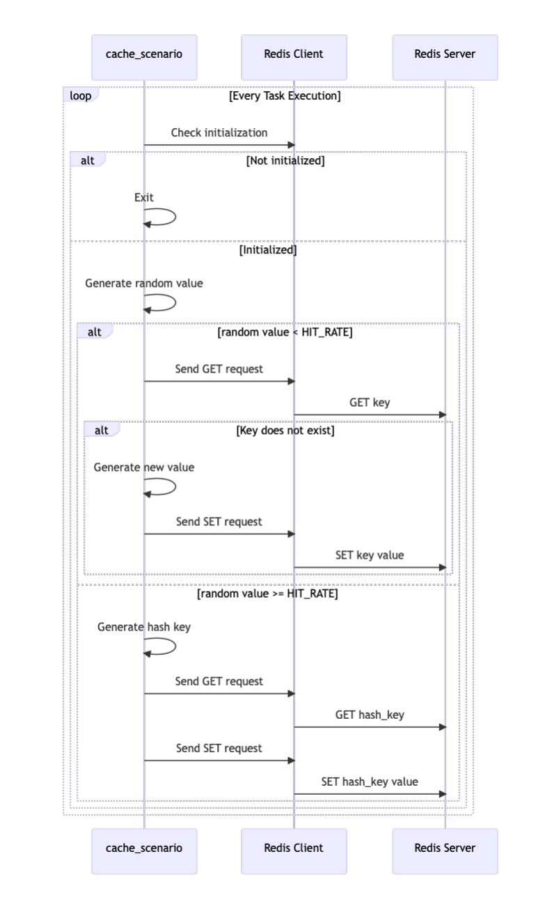

# locust-cache-benchmark

The load testing tool described here builds on the foundational insights provided by the native [redis-benchmark]([redis-benchmark](https://redis.io/docs/latest/operate/oss_and_stack/management/optimization/benchmarks/)) tool, which is an excellent utility for measuring [Redis](https://redis.io/) & [Valkey](https://valkey.io/) throughput and latency under controlled conditions. While [redis-benchmark](https://redis.io/docs/latest/operate/oss_and_stack/management/optimization/benchmarks/) excels at providing raw performance metrics for [Redis](https://redis.io/), this custom solution is designed to extend those capabilities for capacity planning in production-like environments.

By using [Locust](https://locust.io/), this tool simulates realistic workloads with adjustable parameters such as cache hit rates, request rates (get/set req/sec), TTL, and cache sizes. It replicates both cache hit and miss scenarios using random keys, offering a more dynamic testing environment. Additionally, retry logic ensures robustness against temporary errors in the [Redis](https://redis.io/) & [Valkey](https://valkey.io/) cluster, making it suitable for testing under varying conditions.

This approach complements [redis-benchmark](https://redis.io/docs/latest/operate/oss_and_stack/management/optimization/benchmarks/) by focusing on scenarios that mimic real-world application behaviors. Test results, including total requests, cache hits, and hit rates, provide actionable insights for capacity planning and performance optimization in [Redis](https://redis.io/) & [Valkey](https://valkey.io/) deployments.

## Features

- Executes load tests on [Redis](https://redis.io/) & [Valkey](https://valkey.io/) clusters
- Allows configuration of parameters such as cache hit rate, value size, and TTL
- Displays test results in real-time

## Supported Environments

- [Redis](https://redis.io/) Cluster
- [Valkey](https://valkey.io/) Cluster

The above cache service is supported.

## Processing Flow

```mermaid

```



## Attention

- **About Scenario Execution Time**
  - It is recommended to test at least twice as long as the TTL of the data (SET) being stored on the scenario.
    -  It may not be possible to reproduce the assumed situation unless the cache deletion by TTL is performed at least once in the scenario. (except without ttl).
- **Role of locust-cache-benchmark**
  - This tool is designed to simulate request load (get/set req/sec), cache hit rate, cache size, and TTL as expected in a production Redis environment. By applying production-like load over a specific period, it helps in capacity planning and performance evaluation of Redis.
     - However, to maintain a consistent cache hit rate, this tool sends set requests for the portion of requests outside the cache hit rate (100% - cache hit rate). As a result, the number of cached items may exceed what is typically expected in the actual production environment. Please take this characteristic into account when interpreting test results.
- **Memory usage and eviction policies**
  - The increased number of cached items may lead to higher memory usage than expected. Monitor Redis memory consumption and ensure eviction policies are configured appropriately.
- **About request volume**
  - In the creator's environment, the volume of requests is known to be about 700 req/sec more than the overall expected capacity. (Cache hit rate is the same) Therefore, it is required to take this into account before implementation.
    - In the author's environment, I dropped 700 req/sec and set up connection, and it executed as expected.
- **About this tool**
  - This tool uses the init and loadtest commands to achieve load testing. This tool can be executed using workflow, but a dependency between the init and loadtest commands is necessary because if the init is done on a job running in parallel, a useless set for redis will be executed.

## Installation

### Local Machine

Install the necessary dependencies using the following command:

```sh
pip install -r redis-benchmark/requirements.txt
```

### Container

Build and run the Docker container using the command below:

```sh
docker pull ghcr.io/s-mishina/locust-redis-benchmark:latest
```

## Usage (Sample)

### Local Machine

To initialize a Redis cluster, run the following command:

```sh
locust_cache_benchmark init redis -f <hostname> -p <port>
```

To execute a load test on a Redis cluster, use the command:

```sh
locust_cache_benchmark loadtest redis -f <hostname> -p <port> -r <hit_rate> -d <duration> -c <connections> -n <requests> -k <value_size> -t <ttl>
```

### Container

To initialize a Redis cluster, use the following command:

```sh
docker run --rm -it ghcr.io/s-mishina/locust-redis-benchmark:latest locust_cache_benchmark init redis -f <hostname> -p <port>
```

To execute a load test on a Redis cluster, run:

```sh
docker run --rm -it ghcr.io/s-mishina/locust-redis-benchmark:latest locust_cache_benchmark loadtest redis -f <hostname> -p <port> -r <hit_rate> -d <duration> -c <connections> -n <requests> -k <value_size> -t <ttl>
```

## Parameters

- `--fqdn, -f`: Hostname of the Redis server (default: localhost)
- `--port, -p`: Port of the Redis server (default: 6379)
- `--hit-rate, -r`: Cache hit rate (default: 0.5)
- `--duration, -d`: Test duration in seconds (default: 60)
- `--connections, -c`: Number of concurrent connections (default: 1)
- `--spawn-rate, -n`: Number of requests per second (default: 1)
- `--value-size, -k`: Value size in KB (default: 1)
- `--ttl, -t`: Time-to-live of the key in seconds (default: 60)
- `--connections-pool`, -l: Number of connections in the pool (default: 1000000)
- `--query-timeout, -q`: Query timeout in seconds (default: 1)
- `--set-keys, -s`: Number of keys to set in the cache (default: 1000) ※ Parameter for init redis only

## Tips

### It takes time for cloud vendor metrics to appear during the test

If you are using a monitoring tool (e.g., datadog), you can enable redis integration to speed up the data acquisition time by running the redis command to acquire the data.

### I would like to see how you are hitting redis in addition to locust's standard output as a TRACE

This tool will be otel compatible; once otel is supported, you will be able to use otel to check trace.
